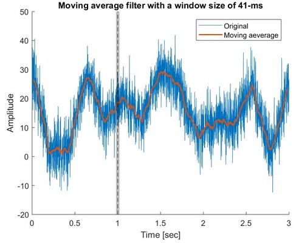

# Signal processing toolbox (Matlab)

## This toolbox includes a few custom Matlab codes enabling essential signal processing operations

__
## Denoising
__
### Moving average
#### Definition
Applies a moving average filter to a time series.
#### Input
    signal: nx1 array corresponding to the tested time series
    sampling_rate: corresponding sampling rate of the time series (i.e. how many frames per seconds, in Hz)
    window: number of frames used to define the size of the window (e.g. a value of 20 would mean that every data point in the original signal will be replaced with the mean of the 20 data points and 20 data points after itself)
    plot: set to 1 if you wish to see the resulting filtered signal
#### Output
    filtered_signal: nx1 array corresponding to the filtered time series
    plot (optional): plot showing the original time series along with the filtered signal and the corresponding window
#### Dependencies
    None
#### Example
    -> go to example folder and run code named moving_average_example.m for more details

__
### Gaussian filter
#### Definition
Applies a Gaussian filter to a time series.
#### Input
    signal: nx1 array corresponding to the tested time series
    mode: select mode to deal with edge effect
            0: set edges to zero
            1: set edges to original signal
            2: set edges to NaN
        sampling_rate: corresponding sampling rate of the time series (i.e.
            how many frames per seconds, in Hz)
        fwhm: full-width at half maximum, key variable defining Gaussian
            filter
        window: number of frames used to define the size of the window
            (e.g. a value of 20 would mean that every data point in the
            original signal will be replaced with the mean of the 20 data
            points and 20 data points after itself)
        plot: set to 1 if you wish to see the resulting filtered signal
#### Output
    filtered_signal: nx1 array corresponding to the filtered time series
    plot (optional): plot showing the original time series along with the filtered signal and the corresponding window
#### Dependencies
    None
#### Example
    -> go to example folder and run code named gaussian_example.m for more details

