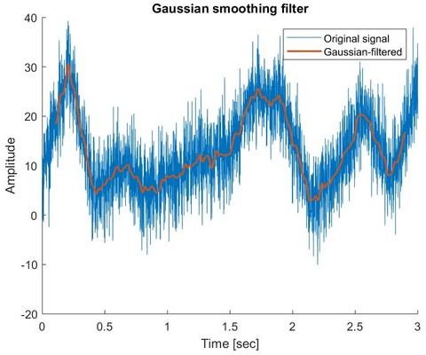
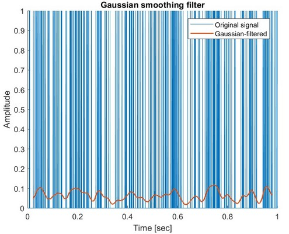

## Denoising (Matlab)
__
### Gaussian filter
#### Definition
Applies a Gaussian filter to denoise a time series.
#### Input
    signal: nx1 array corresponding to the tested time series
    mode: select mode to deal with edge effect
            0: set edges to zero
            1: set edges to original signal
            2: set edges to NaN
    sampling_rate: corresponding sampling rate of the time series
        (i.e. how many frames per seconds, in Hz)
    fwhm: full-width at half maximum, key variable defining Gaussian
        filter
    window: number of frames used to define the size of the window
        (e.g. a value of 20 would mean that every data point in the original
        signal will be replaced with the mean of the 20 data points before
        and the 20 data points after itself)
    plot: set to 1 if you wish to see the resulting filtered signal
#### Output
    filtered_signal: nx1 array corresponding to the filtered time series
    plot (optional): plots showing (1) the Gaussian with the corresponding
        full-width at half maximum, and (2) the original and filtered signals
#### Dependencies
    None
#### Example
    -> go to example folder and run code named gaussian_example.m
        or gaussian_spikes_example.m for more details

__
### Median spike denoising filter
#### Definition
Applies a Median filter to a denoise time series (especially to remove spikes).
    Note: for the manual threshold selection, look at the histogram and
    select a point located right from the largest concentration of
    points.
#### Input
    signal: nx1 array corresponding to the tested time series
    window: number of frames used to define the size of the window
        (e.g. a value of 20 would mean that every data point in the original
        signal will be replaced with the mean of the 20 data points before
        and the 20 data points after itself)
    plot: set to 1 if you wish to see the resulting filtered signal
#### Output
    filtered_signal: nx1 array corresponding to the filtered time series
    plot (optional): plot showing the original and filtered signals
#### Dependencies
    None
#### Example
    -> go to example folder and run code named median_filter_example.m for more details

__
### Moving average
#### Definition
Applies a moving average filter to denoise a time series.
#### Input
    signal: nx1 array corresponding to the tested time series
    sampling_rate: corresponding sampling rate of the time series
        (i.e. how many frames per seconds, in Hz)
    window: number of frames used to define the size of the window
        (e.g. a value of 20 would mean that every data point in the original
        signal will be replaced with the mean of the 20 data points before
        and the 20 data points after itself)
    plot: set to 1 if you wish to see the resulting filtered signal
#### Output
    filtered_signal: nx1 array corresponding to the filtered time series
    plot (optional): plot showing the original and filtered signals along 
        with the corresponding window
#### Dependencies
    None
#### Example
    -> go to example folder and run code named moving_average_example.m for more details

__
### Teager-Kaiser Energy-tracking Operator (TKEO) and Z-Score
#### Definition
 Applies a Teager-Kaiser Energy-tracking Operator (TKEO) to denoise a time series (e.g. Electromyogram (EMG)) and generate the corresponding Z-Scores (potential application: activation detection for EMG signals).
#### Input
    signal: nx1 array corresponding to the tested time series
    sampling_rate: corresponding sampling rate of the time series (i.e.
        how many frames per seconds, in Hz)
    plot: set to 1 if you wish to see the resulting filtered signal
#### Output
    filtered_signal: nx1 array corresponding to the filtered time series
    signal_zscore: nx1 array corresponding to z-score of the original time series
    filtered_signal_zscore: nx1 array corresponding to z-score of the filtered 
        time series
    plot (optional): plot showing the original and filtered signals along with 
        the corresponding z-scores
#### Dependencies
    None
#### Example
    -> go to example folder and run code named tkeo_zscore_example.m and use
        the file emg_sample.mat for more details

