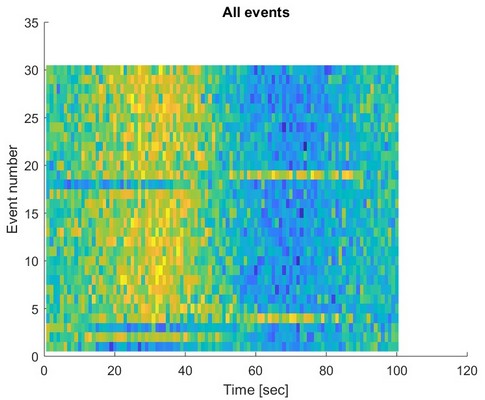
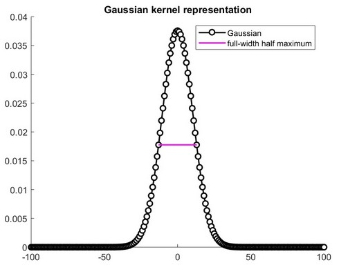
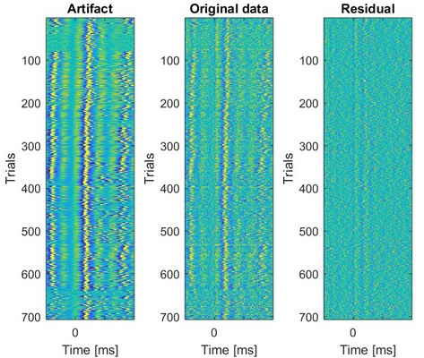
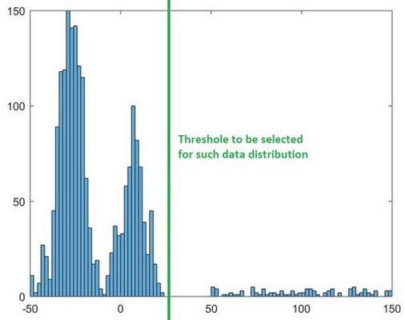
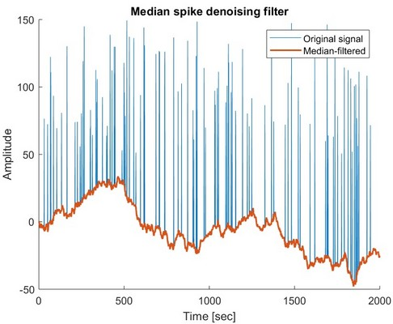
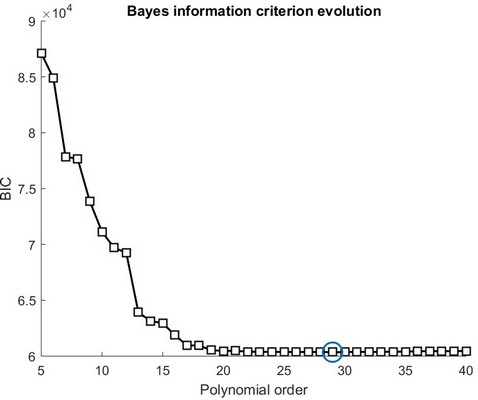
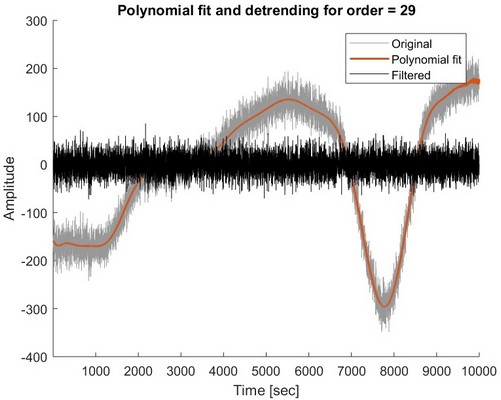

## Denoising (Matlab)

### Average repetitive events
#### Definition
Restructure a time series composed of repetitive events into a matrix and calculate the corresponding average.
    Note: this code assumes that each event has a constant duration.
#### Input
    signal: nx1 array corresponding to the tested time series
    dur: duration of each event (in frames)
    onset: mx1 array corresponding to the frame numbers when each event
        happens (when m = number of events in the signal)
    plotting: set to 1 if you wish to see the resulting restructured matrix
        [default = 0]
#### Output
    data_matrix: nxm array corresponding to the restructured matrix
    plot (optional): plot showing the restructured matrix
#### Dependencies
    None
#### Example
    -> go to example folder and run code named average_rep_events_example.m
        for more details

__
### Gaussian filter
#### Definition
Applies a Gaussian filter to denoise a time series.
#### Input
    signal: nx1 array corresponding to the tested time series
    mode: select mode to deal with edge effect
            0: set edges to zero
            1: set edges to original signal
            2: set edges to NaN [default]
    sampling_rate: corresponding sampling rate of the time series
        (i.e. how many frames per seconds, in Hz)
        [default = length(signal)]
    fwhm: full-width at half maximum, key variable defining Gaussian
        filter [default = 25]
    window: number of frames used to define the size of the window
        (e.g. a value of 20 would mean that every data point in the original
        signal will be replaced with the mean of the 20 data points before
        and the 20 data points after itself) [default = 20]
    plotting: set to 1 if you wish to see the resulting filtered signal
        [default = 0]
#### Output
    filtered_signal: nx1 array corresponding to the filtered time series
    plot (optional): plots showing (1) the Gaussian with the corresponding
        full-width at half maximum, and (2) the original and filtered signals
#### Dependencies
    None
#### Example
    -> go to example folder and run code named gaussian_example.m
        or gaussian_spikes_example.m for more details

__
### Linear detrending
#### Definition
Applies the detrend function remove the linear trend from a time series.
    Note: added option to plot original and filtered signals.
#### Input
    signal: nx1 array corresponding to the tested time series
    plotting: set to 1 if you wish to see the resulting filtered signal
        [default = 0]
#### Output
    filtered_signal: nx1 array corresponding to the filtered time series
    plot (optional): plot showing the original and filtered signals
#### Dependencies
    None
#### Example
    -> go to example folder and run code named linear_detrend_example.m for more details

__
### Least-squares template matching filter
#### Definition
Applies a least-squares template-matching filter to remove a potential artifact from a data set.
    Note: works for 1D time series as well as multiple channels (e.g.
    original data set containing 10 channels of 10 distinct time
    series).
#### Input
    data: nxm array corresponding to the original data set
    artifact: nxm array corresponding to the artifact data set
#### Output
    residual: nx1 array corresponding to the filtered data
#### Dependencies
    None
#### Example
    -> go to example folder and run code named lstm_filter_example.m and use
        the file lstm_sample.mat for more details

__
### Median spike denoising filter
#### Definition
Applies a Median filter to a denoise time series (especially to remove spikes).
    Note: for the manual threshold selection, look at the histogram and
    select a point located right from the largest concentration of
    points.
#### Input
    signal: nx1 array corresponding to the tested time series
    window: number of frames used to define the size of the window
        (e.g. a value of 20 would mean that every data point in the original
        signal will be replaced with the mean of the 20 data points before
        and the 20 data points after itself) [default = 20]
    plotting: set to 1 if you wish to see the resulting filtered signal
        [default = 0]
#### Output
    filtered_signal: nx1 array corresponding to the filtered time series
    plot (optional): plot showing the original and filtered signals
#### Dependencies
    None
#### Example
    -> go to example folder and run code named median_filter_example.m for more details

__
### Moving average
#### Definition
Applies a moving average filter to denoise a time series.
#### Input
    signal: nx1 array corresponding to the tested time series
    sampling_rate: corresponding sampling rate of the time series
        (i.e. how many frames per seconds, in Hz)
        [default = length(signal)]
    window: number of frames used to define the size of the window
        (e.g. a value of 20 would mean that every data point in the original
        signal will be replaced with the mean of the 20 data points before
        and the 20 data points after itself) [default = 20]
    plotting: set to 1 if you wish to see the resulting filtered signal
        [default = 0]
#### Output
    filtered_signal: nx1 array corresponding to the filtered time series
    plot (optional): plot showing the original and filtered signals along 
        with the corresponding window
#### Dependencies
    None
#### Example
    -> go to example folder and run code named moving_average_example.m for more details

__
### Polynomial detrending
#### Definition
Calculated the optimal Bayes information criterion (BIC), generate the corresponding polynomial fit (order = optimal BIC), and applies a polynomial detrend to denoise a time series.
#### Input
    signal: nx1 array corresponding to the tested time series
    plotting: set to 1 if you wish to see the resulting filtered signal
        [default = 0]
#### Output
    filtered_signal: nx1 array corresponding to the filtered time series
    plot (optional): plot showing the corresponding BIC evolution and
        the original and filtered signals
#### Dependencies
    None
#### Example
    -> go to example folder and run code named poly_detrend_example.m for more details

__
### Teager-Kaiser Energy-tracking Operator (TKEO) and Z-Score
#### Definition
 Applies a Teager-Kaiser Energy-tracking Operator (TKEO) to denoise a time
 series (e.g. Electromyogram (EMG)) and generate the corresponding Z-Scores
 (potential application: activation detection for EMG signals).
#### Input
    signal: nx1 array corresponding to the tested time series
    time: nx1 array corresponding to the time of the tested time series
        [default = 0:length(signal)]
    plotting: set to 1 if you wish to see the resulting filtered signal
        [default = 0]
#### Output
    filtered_signal: nx1 array corresponding to the filtered time series
    signal_zscore: nx1 array corresponding to z-score of the original time series
    filtered_signal_zscore: nx1 array corresponding to z-score of the filtered 
        time series
    plot (optional): plot showing the original and filtered signals along with 
        the corresponding z-scores
#### Dependencies
    None
#### Example
    -> go to example folder and run code named tkeo_zscore_example.m and use
        the file emg_sample.mat for more details

