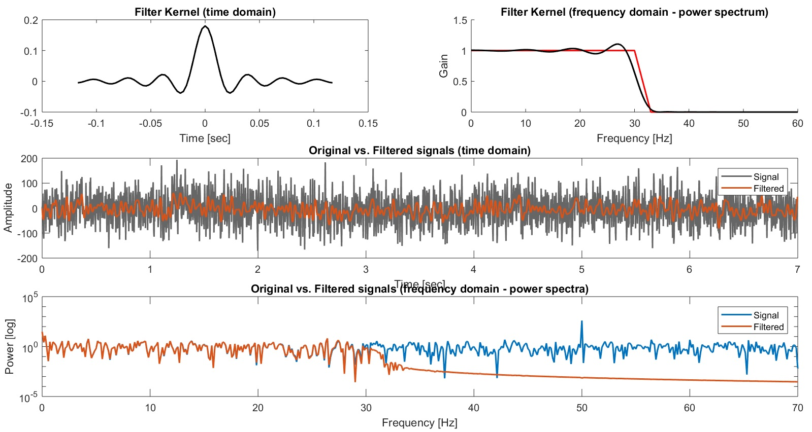

## Filtering (Matlab)

### Finite Impulse Response (FIR) least-square filter
#### Definition
Applies a Finite Impulse Response (FIR) least-square filter to a time series.
    Note: uses firls function.
#### Input
    signal: nx1 array corresponding to the tested time series
    mode: select type of filter
        0: low-pass filter (gets ride of high frequencies) [default]
        1: high-pass filter (gets ride of low frequencies)
    sampling_rate: corresponding sampling rate of the time series (i.e.
        how many frames per seconds, in Hz) [default = length(signal)]
    cutoff_f: cut-off frequency (frequencies above this value will be
        filtered) [default (arbitrary) = 30]
    order: define order of the Kernel (higher order will have more time
        points and bring the Actual Kernel closer to the Ideal Kernel,       but too high values will also add artifacts) [default = 5]
    plotting: set to 1 if you wish to see the resulting Kernel and 
        filtered signal [default = 0]
#### Output
    filtered_signal: nx1 array corresponding to the filtered signal
    plot (optional): plots showing (1) the Kernel (in time and frequency
        domains), and (2) the original and filtered signals (in time and
        frequency domains)
#### Dependencies
    None
#### Example
    -> go to example folder and run code named firls_filter_example.m
        for more details

__
### X
#### X
Text.
#### X
    variable: text
#### X
    variable: text
#### X
    None
#### X
    -> go to example folder and run code named X.m for more details

