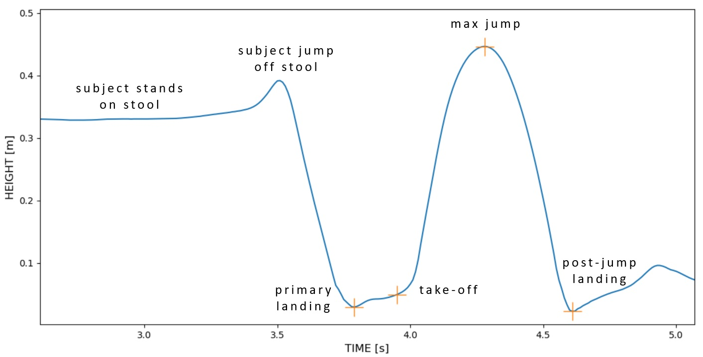
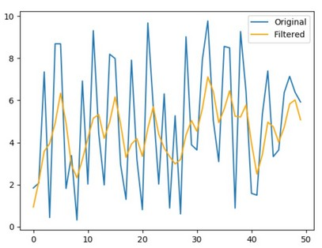
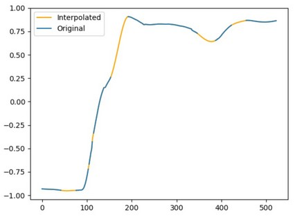

# Signal processing toolbox

## This toolbox includes a few custom python codes enabling essential signal processing operations

__
## Dynamic time wrapping (DTW) excursion
#### Definition:
Apply an approximate Dynamic Time Warping (DTW) algorithm [1] to compare two time series and calculate the corresponding mean and standard deviations of the amplitude and temporal excursions
        Note: the DTW used does not work if time series has infinite or NaN values, therefore, the code will look for NaNs and only keep the non-NaN values
            [1] provides optimal or near-optimal alignments with an O(N) time and memory complexity, written based on Stan Salvador, and Philip Chan. “FastDTW: Toward accurate dynamic time warping in linear time and space.” Intelligent Data Analysis 11.5 (2007): 561-580.
#### Input
    x_series1: nx1 array corresponding to the time vector defining time series #1
    y_series1: nx1 array corresponding to the amplitude vector defining time series #1
    x_series2: nx1 array corresponding to the time vector defining time series #2
    y_series2: nx1 array corresponding to the amplitude vector defining time series #2
    plot: if set to True will plot the two time series with the corresponding connections resulting from the shortest path calculated by the fast DTW
#### Output
    m_temp_exc: mean temporal excursion
    std_temp_exc: standard deviation of the temporal excursion
    m_amp_exc: mean amplitude excursion
    std_amp_exc: standard deviation of the amplitude excursion
#### Dependencies
    nan_find.py
#### Example
    -> the time series were imported from a random drop vertical jump data set
    time series 1 -> right knee flexion angle (Vicon)
    time series 2 -> right knee flexion angle (Kinect)

    m_temp_exc, std_temp_exc, m_amp_exc, std_amp_exc = dtw_excursion(x_series1, y_series1, x_series2, y_series2, plot=None, mode=None)

__
## Event detection algorithm (drop vertical jump)
#### Definition:
Detect box jump, primary landing, takeoff, maximal jump and secondary landing during a drop vertical jump (DVJ) trial.
#### Input
    time: nx1 array: define time series (in secs)
    right_signal: nx1 array: z-coordinates of the right ankle
    left_signal: nx1 array: z-coordinates of the left ankle
    mode: select between 'manual', 'auto' and 'hybrid'
    plot: plot the corresponding outcome for verification (if True)
    height_threshold_factor: select a height threshold factor for the detection of peaks (in %)
            e.g. a value of X means that only peaks that have a y-value of more than X% of the max height of the signal will be found (default: 80% of the max)
    window: select how many data points will be included in the window used to detect box jump, landings and take-off (default 50)
#### Output
    R_events: 5x1 array including the frame indices of the different events detected for the right foot
    L_events: 5x1 array including the frame indices of the different events detected for the left foot
#### Dependencies
    None
#### Example
    -> the time series was imported from a random drop vertical jump data set
    RAJz -> tracking of the right ankle z-coordinates
    LAJz -> tracking of the left ankle z-coordinates
    
    R_events, L_events = dvj_event_detection(time, RAJz, LAJz, mode=mode, plot=True, height_threshold_factor=80 window=50)

__
## Moving average filter
#### Definition
Applies a moving average filter to a time series.
#### Input
    y: nx1 array: tested time series (e.g. x coordinates of a marker)
    mode: select type of moving average ('standard' or 'gaussian' - default: gaussian)
    window_sigma: define the window size (standard mode) or sigma (gaussian mode)
                recommended window sizes: 3, 6, 10, 16, 22, 35 (the bigger the smoother - default: 3)
                recommended sigma values: 1, 2, 3, 5, 8, 10 (the bigger the smoother - default: 1)
    plot: plot the original and filtered data if True
#### Output
    y_avg: new nx1 array with filtered time series
    Note: y_avg may have less observations around the edge of the data
#### Dependencies
    None
#### Example
    signal = np.random.rand(50,1)*10
    signal_avg = moving_average(signal, mode='gaussian', window_sigma=1, plot=True)

## Event detection algorithm (single-legged distance jump)
#### Definition:
Detect takeoff and landing during a single-legged distance jump trial.
#### Input
    time: nx1 array: define time series (in secs)
    signal: nx1 array: z-coordinates of the right/left ankle
    side: choose between 'right' and 'left'
    mode: select between 'manual' and 'auto'
    plot: plot the corresponding outcome for verification (if True)
#### Output
    events: 2x1 array including the frame indices of the different events detected (right or left)
#### Dependencies
    moving_average.py

__
## Find NaNs indices
#### Definition
Generates a NaNs logical array where the indices of each NaN observation is Tru, and then generates a local function that can extract the indices of each NaN observation as a list.
#### Input
    y: nx1 array that contains NaNs
#### Output
    nan_logic: logical array where the indices of each NaN observation is True
    find_true: function that returns the indices of all True observations in an array.
#### Dependencies
    None
#### Example
    nan_logic, find_true = nan_find(y)
    find_true(nan_logic) -> returns array with indices of all NaN in y
    find_true(~nan_logic) -> returns array with indices of all non-NaN in y

__
## Cubic spline fill
#### Definition
Assesses if time series has missing observations (i.e. NaN), then interpolates missing observations using a cubic spline fitted to the data.
#### Input
    x: nx1 array corresponding to the frames indices
    y: nx1 array: tested time series (e.g. x coordinates of a marker)
#### Output
    y_interp: new nx1 array with interpolated values replacing NaNs (only returned if data has NaNs)
    Notes:
        - Only interpolates time series with NaN (otherwise return original time series)
        - Does not interpolate empty time series (returns same empty time series)
        - Does not interpolate the beginning and/or end of the time series if it has missing observations (i.e. only interpolates between edges)
#### Dependencies
    nan_find.py
#### Example
    -> the time series y was imported from a random data set
    y_interp = cubic_spline_fill(x, y)

__
## Cubic spline fill (3D)
#### Definition
Applies cubic spline fill to each dimension of a 3D time series.
#### Input
    x: nx1 array corresponding to the frames indices
    y: nx3 array: tested time series (e.g. x, y, z coordinates of a marker)
#### Output
    Y_interp: new nx3 array with interpolated values replacing NaNs (only returned if data has NaNs)
#### Dependencies
    nan_find.py
    cubic_spline_fill.py
#### Example
    Y_interp = cubic_spline_fill_3D(x, y)

__
## Cubic spline resampling
#### Definition
Fits a cubic spline to the data and resamples the corresponding time series to the desired sampling rate.
#### Input
    time: nx1 array corresponding to the time (in secs)
    y: nx1 array: tested time series (e.g. x coordinates of a marker)
    rf: resampling frequency (Hz)
#### Output
    y_resampled: array corresponding to resampled time series
        Note: Keeps the original values of the time series
    time_resampled: array corresponding to resampled time
#### Dependencies
    None
#### Example
    y_resampled = cubic_spline_resample(time, y, rf)

__
## Cubic spline resampling (3D)
#### Definition
Applies cubic spline resample to each dimension of a 3D time series.
#### Input
    time: nx1 array corresponding to the time (in secs)
    y: nx3 array: tested time series (e.g. x coordinates of a marker)
    rf: resampling frequency (Hz)
#### Output
    Y_resampled: array corresponding to resampled time series
        Note: Keeps the original values of the time series
    time_resampled: array corresponding to resampled time
#### Dependencies
    cubic_spline_resample.py
#### Example
    Y_resampled, time_resampled = cubic_spline_resample_3D(time, y, rf)

__
## Find peaks within a noisy signal
#### Definition
Find peaks within a noisy signal via the corresponding filtered signal (i.e. removes noisy peaks).
#### Input
    y: nx1 array: tested time series (e.g. x coordinates of a marker)
    y_filtered: nx1 array: filtered time series
    height: Required height of peaks. Either a number, None, an array matching x or a 2-element sequence of the former.The first element is always interpreted as the minimal and the second, if supplied, as the maximal required height.
    window: number of data points defining the window size within which the code will look for peaks around the detected peaks within the filtered signal
#### Output
    true_peaks: indices of the peaks within the original signal that are the highest around the filtered peaks
#### Dependencies
    None
#### Example
    true_peaks_idx = true_peaks(y, y_filtered, height=None, window=None)
