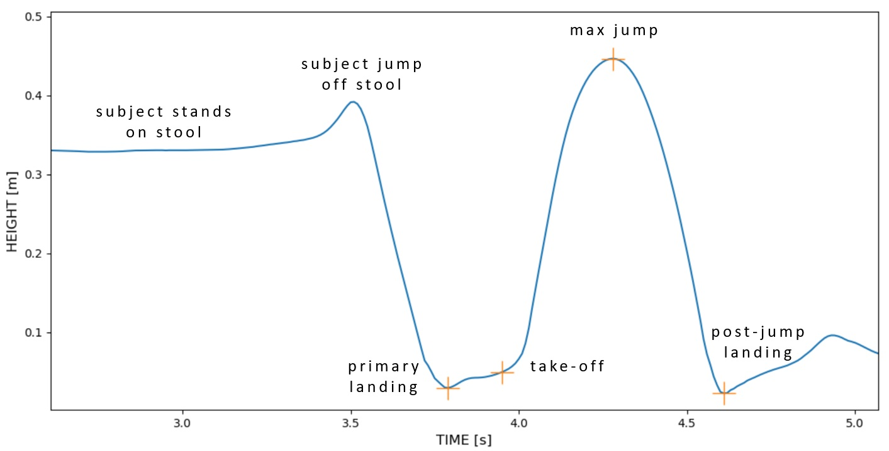

# Event detection (Python)

### Event detection algorithm (drop vertical jump)
#### Definition:
Detect box jump, primary landing, takeoff, maximal jump and secondary landing during a drop vertical jump (DVJ) trial.
#### Input
    time: nx1 array: define time series (in secs)
    right_signal: nx1 array: z-coordinates of the right ankle
    left_signal: nx1 array: z-coordinates of the left ankle
    mode: select between 'manual', 'auto' and 'hybrid'
    plot: plot the corresponding outcome for verification (if True)
    height_threshold_factor: select a height threshold factor for the detection of peaks (in %)
            e.g. a value of X means that only peaks that have a y-value of more than X% of the max height of the signal will be found (default: 80% of the max)
    window: select how many data points will be included in the window used to detect box jump, landings and take-off (default 50)
#### Output
    R_events: 5x1 array including the frame indices of the different events detected for the right foot
    L_events: 5x1 array including the frame indices of the different events detected for the left foot
#### Dependencies
    None
#### Example
    -> the time series was imported from a random drop vertical jump data set
    RAJz -> tracking of the right ankle z-coordinates
    LAJz -> tracking of the left ankle z-coordinates
    
    R_events, L_events = dvj_event_detection(time, RAJz, LAJz, mode=mode, plot=True, height_threshold_factor=80 window=50)

__
### Event detection algorithm (single-legged distance jump)
#### Definition:
Detect takeoff and landing during a single-legged distance jump trial.
#### Input
    time: nx1 array: define time series (in secs)
    signal: nx1 array: z-coordinates of the right/left ankle
    side: choose between 'right' and 'left'
    mode: select between 'manual' and 'auto'
    plot: plot the corresponding outcome for verification (if True)
#### Output
    events: 2x1 array including the frame indices of the different events detected (right or left)
#### Dependencies
    None
