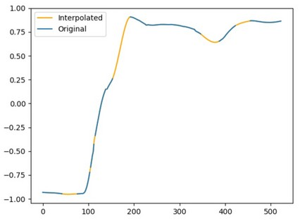

# Interpolation and resampling

### Cubic spline fill
#### Definition
Assesses if time series has missing observations (i.e. NaN), then interpolates missing observations using a cubic spline fitted to the data.
#### Input
    x: nx1 array corresponding to the frames indices
    y: nx1 array: tested time series (e.g. x coordinates of a marker)
#### Output
    y_interp: new nx1 array with interpolated values replacing NaNs (only returned if data has NaNs)
    Notes:
        - Only interpolates time series with NaN (otherwise return original time series)
        - Does not interpolate empty time series (returns same empty time series)
        - Does not interpolate the beginning and/or end of the time series if it has missing observations (i.e. only interpolates between edges)
#### Dependencies
    nan_find.py
#### Example
    -> the time series y was imported from a random data set
    y_interp = cubic_spline_fill(x, y)

__
### Cubic spline fill (3D)
#### Definition
Applies cubic spline fill to each dimension of a 3D time series.
#### Input
    x: nx1 array corresponding to the frames indices
    y: nx3 array: tested time series (e.g. x, y, z coordinates of a marker)
#### Output
    Y_interp: new nx3 array with interpolated values replacing NaNs (only returned if data has NaNs)
#### Dependencies
    nan_find.py
    cubic_spline_fill.py
#### Example
    Y_interp = cubic_spline_fill_3D(x, y)

__
### Cubic spline resampling
#### Definition
Fits a cubic spline to the data and resamples the corresponding time series to the desired sampling rate.
#### Input
    time: nx1 array corresponding to the time (in secs)
    y: nx1 array: tested time series (e.g. x coordinates of a marker)
    rf: resampling frequency (Hz)
#### Output
    y_resampled: array corresponding to resampled time series
        Note: Keeps the original values of the time series
    time_resampled: array corresponding to resampled time
#### Dependencies
    None
#### Example
    y_resampled = cubic_spline_resample(time, y, rf)

__
### Cubic spline resampling (3D)
#### Definition
Applies cubic spline resample to each dimension of a 3D time series.
#### Input
    time: nx1 array corresponding to the time (in secs)
    y: nx3 array: tested time series (e.g. x coordinates of a marker)
    rf: resampling frequency (Hz)
#### Output
    Y_resampled: array corresponding to resampled time series
        Note: Keeps the original values of the time series
    time_resampled: array corresponding to resampled time
#### Dependencies
    cubic_spline_resample.py
#### Example
    Y_resampled, time_resampled = cubic_spline_resample_3D(time, y, rf)

__
### Find NaNs indices
#### Definition
Generates a NaNs logical array where the indices of each NaN observation is Tru, and then generates a local function that can extract the indices of each NaN observation as a list.
#### Input
    y: nx1 array that contains NaNs
#### Output
    nan_logic: logical array where the indices of each NaN observation is True
    find_true: function that returns the indices of all True observations in an array.
#### Dependencies
    None
#### Example
    nan_logic, find_true = nan_find(y)
    find_true(nan_logic) -> returns array with indices of all NaN in y
    find_true(~nan_logic) -> returns array with indices of all non-NaN in y

### Reshape
#### Definition
Reshape a data set to a specified length.
#### Input
    data: nxm array -> original data set (n=number of observation, length |
        m: number of variables)
    reshape_length: desired number of observations (i.e. new data length)
#### Output
    reshaped_data: reshape_lengthxm array containing the reshaped data set
    idx_array: reshape_lengthx1 array containing the index of the observations
        that will be maintained in the reshaped signal (equally distributed)

__
### Find peaks within a noisy signal
#### Definition
Find peaks within a noisy signal via the corresponding filtered signal (i.e. removes noisy peaks).
#### Input
    y: nx1 array: tested time series (e.g. x coordinates of a marker)
    y_filtered: nx1 array: filtered time series
    height: Required height of peaks. Either a number, None, an array matching
        or a 2-element sequence of the former.The first element is always
        interpreted as the minimal and the second, if supplied, as the maximal
        required height.
    window: number of data points defining the window size within which the
        code will look for peaks around the detected peaks within the filtered
        signal
#### Output
    true_peaks: indices of the peaks within the original signal that are the highest around the filtered peaks
#### Dependencies
    None
#### Example
    true_peaks_idx = true_peaks(y, y_filtered, height=None, window=None)
