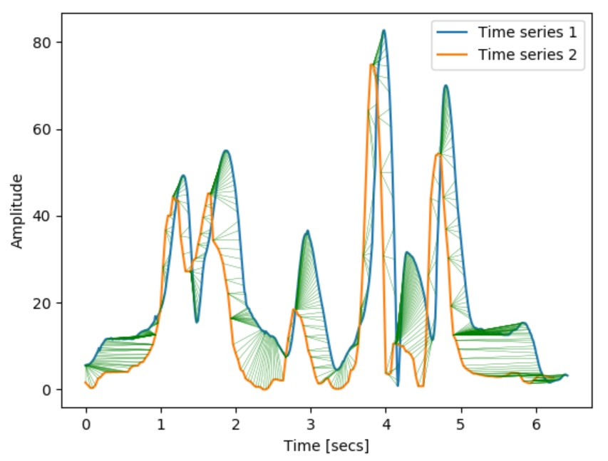

# Signals comparison (Python)

### Dynamic time wrapping (DTW) excursion
#### Definition:
Apply an approximate Dynamic Time Warping (DTW) algorithm [1] to compare two time series and calculate the corresponding mean and standard deviations of the amplitude and temporal excursions
        Note: the DTW used does not work if time series has infinite or NaN values, therefore, the code will look for NaNs and only keep the non-NaN values
            [1] provides optimal or near-optimal alignments with an O(N) time and memory complexity, written based on Stan Salvador, and Philip Chan. “FastDTW: Toward accurate dynamic time warping in linear time and space.” Intelligent Data Analysis 11.5 (2007): 561-580.
#### Input
    x_series1: nx1 array corresponding to the time vector defining time series #1
    y_series1: nx1 array corresponding to the amplitude vector defining time series #1
    x_series2: nx1 array corresponding to the time vector defining time series #2
    y_series2: nx1 array corresponding to the amplitude vector defining time series #2
    plot: if set to True will plot the two time series with the corresponding connections resulting from the shortest path calculated by the fast DTW
#### Output
    m_temp_exc: mean temporal excursion
    std_temp_exc: standard deviation of the temporal excursion
    m_amp_exc: mean amplitude excursion
    std_amp_exc: standard deviation of the amplitude excursion
#### Dependencies
    nan_find.py
#### Example
    -> the time series were imported from a random drop vertical jump data set
    time series 1 -> right knee flexion angle (Vicon)
    time series 2 -> right knee flexion angle (Kinect)

    m_temp_exc, std_temp_exc, m_amp_exc, std_amp_exc = dtw_excursion(x_series1, y_series1, x_series2, y_series2, plot=None, mode=None)

