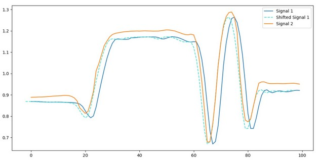

# Signals comparison (Python)

### Intraclass Correlation Coefficient (ICC) using the Two-way Mixed Model for Case 3
#### Definition:
Calculate the Intraclass Correlation Coefficient (ICC) using the Two-way Mixed Model for Case 3* defined by Patrick E. Shrout and Joseph L. Fleiss. “Intraclass Correlations: Uses in assessing rater reliability.” Psychological Bulletin 86.2 (2979): 420-428
        *In Case 3, each target/subject/observation is rated by each of the same m observers/judges/methods, who are the only observers/judges/methods of interest.
#### Input
    data: mxn array where m is the number of rows (each row is a measurement/observation/subject) and where n is the number of observers/judges/methods
#### Output
    ICC: intraclass correlation coeeficient (3,1)
    df_m: number of degrees of freedom (df) between observers/judges/methods
    df_n: number of degrees of freedom (df) between measurements/observations/subjects
    F_stat: F-Statistic - session effect (calculated as the ratio between the vartiation between sample means and the variation within samples - i.e. ratio of two quantities that are expected to be roughly equal under the null hypothesis)
    var_obs: variance between measurements/observations/subjects
    MSE: mean squared error (calculated as the sum of squared error divided by the number of degrees of freedom between measurements/observations/subjects: SSE/df_n)
#### Dependencies
    None

### Time delay between signal (for each observation): Cross-correlation using Fast Fourrier Transform
#### Definition:
Calculate the time shift between 2 signals using a Fast Fourrier Transform (FFT).
#### Input
    x: nx1 array corresponding to the amplitude vector defining time series #1
    y: nx1 array corresponding to the amplitude vector defining time series #2
#### Output
    time_shift: time shift for every observation (time series)
#### Dependencies
    None

### Time delay between signal (maximal shift): Cross-correlation using Fast Fourrier Transform
#### Definition:
Calculate the maximal time shift between 2 signals using a Fast Fourrier Transform (FFT).
#### Input
    x: nx1 array corresponding to the amplitude vector defining time series #1
    y: nx1 array corresponding to the amplitude vector defining time series #2
#### Output
    max_time_shift: maximal time shift
#### Dependencies
    None
#### Example
    -> the time series were imported from a random drop vertical jump data set
    time series 1 -> right hip vertical trajectory (Vicon)
    time series 2 -> right hip vertical trajectory (Kinect)

    time_shift = time_delay_fft(x, y)

### Dynamic time wrapping (DTW) excursion
#### Definition:
Apply an approximate Dynamic Time Warping (DTW) algorithm [1] to compare two time series and calculate the corresponding mean and standard deviations of the amplitude and temporal excursions
        Note: the DTW used does not work if time series has infinite or NaN values, therefore, the code will look for NaNs and only keep the non-NaN values
            [1] provides optimal or near-optimal alignments with an O(N) time and memory complexity, written based on Stan Salvador, and Philip Chan. “FastDTW: Toward accurate dynamic time warping in linear time and space.” Intelligent Data Analysis 11.5 (2007): 561-580.
#### Input
    x_series1: nx1 array corresponding to the time vector defining time series #1
    y_series1: nx1 array corresponding to the amplitude vector defining time series #1
    x_series2: nx1 array corresponding to the time vector defining time series #2
    y_series2: nx1 array corresponding to the amplitude vector defining time series #2
    plot: if set to True will plot the two time series with the corresponding connections resulting from the shortest path calculated by the fast DTW
#### Output
    m_temp_exc: mean temporal excursion
    std_temp_exc: standard deviation of the temporal excursion
    m_amp_exc: mean amplitude excursion
    std_amp_exc: standard deviation of the amplitude excursion
#### Dependencies
    nan_find.py
#### Example
    -> the time series were imported from a random drop vertical jump data set
    time series 1 -> right knee flexion angle (Vicon)
    time series 2 -> right knee flexion angle (Kinect)

    m_temp_exc, std_temp_exc, m_amp_exc, std_amp_exc = dtw_excursion(x_series1, y_series1, x_series2, y_series2, plot=None, mode=None)

