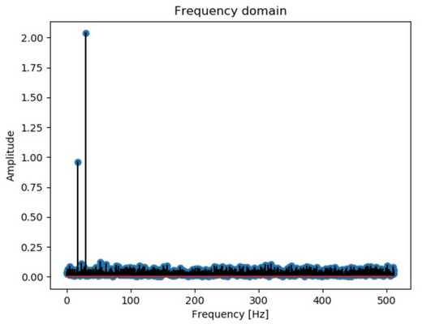

## Spectral analysis (Python)

### Fast Fourier Transform
#### Definition
Applies a Fast Fourier Transform (FFT) to perform the spectral analysis of a time series.
#### Input
    signal: nx1 array corresponding to the tested time series
    sampling_rate: corresponding sampling rate of the time series
        (i.e. how many frames per seconds, in Hz) [default = len(signal)]
    plotting: set to 1 if you wish to see the resulting figures
        [default = 0]
#### Output
    fourier_signal: nx1 array corresponding to the fourier transform of
        the time series
    amp_spectrum: nx1 array corresponding to amplitude spectrum of the
        time series (frequency space)
    recon_signal: nx1 array corresponding to the reconstructed signal
        using the inverse FFT
    plot (optional): plot showing the resulting signal and its
        inverse reconstruction in time and frequency space
#### Dependencies
    None
#### Example
    -> go to example folder and run code named fft_spectral_example.m
        for more details

__
### Welch's method
#### Definition
Applies Welch's method to a time series for spectral density estimation.
#### Input
    signal: nx1 array corresponding to the tested time series
    sampling_rate: corresponding sampling rate of the time series
        (i.e. how many frames per seconds, in Hz) [default = len(signal)]
    window: number of frames used to define the size of the window
        (i.e. how many data points are included in each isolated portion of the original signal)
        [default = sampling rate]
    overlap: number of frames where two consecutive windows will overlap
        [default = half of sampling rate]
    plotting: set to 1 if you wish to see the resulting filtered signal
        [default = 0]
#### Output
    welch_power: corresponding power spectrum using Welch's method
    plot (optional): plots showing (1) defined Hann window and the
        corresponding edge attenuation on a random sample, and
        (2) the comparison between the power spectra obtained via Static FFT and Welch's method
#### Dependencies
    None
#### Example
    -> go to example folder and run code named welch_example.m
        for more details

